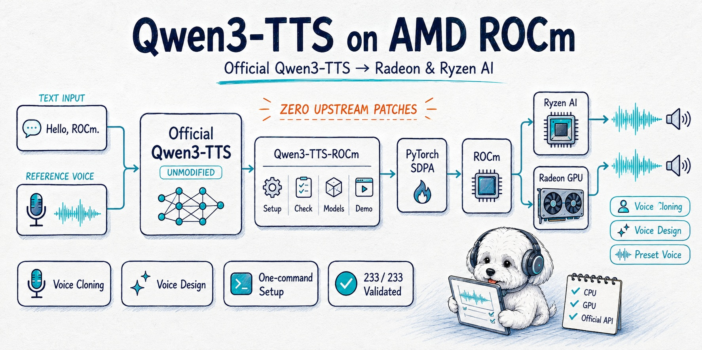

<p align="center">
  
</p>

# Qwen3-TTS on AMD ROCm

**Official Qwen3-TTS. AMD Radeon. Zero upstream patches.**

Run the unmodified official [`qwen-tts`](https://github.com/QwenLM/Qwen3-TTS)
package on AMD Ryzen AI Max+ PRO 395 / Radeon 8060S (`gfx1151`): one command
installs AMD's pinned ROCm 7.14.0 PyTorch wheels, the next downloads the
official checkpoints, the third opens a bilingual five-tab Gradio demo on
`http://localhost:8000`. Every synthesis call stays on official APIs.

**English** | [简体中文](README_CN.md)

[](https://github.com/AIwork4me/Qwen3-TTS-ROCm/actions/workflows/ci.yml)
[](https://github.com/AIwork4me/Qwen3-TTS-ROCm/releases)
[](LICENSE)
[](https://www.python.org/)
[](https://rocm.docs.amd.com/)
[](docs/benchmarks.md#platform)

Unofficial community project — not affiliated with or endorsed by Alibaba or
AMD. See [Attribution](#attribution--disclaimer).

## Verified, not promised

| Validation | Result |
|---|---|
| Official model repositories | **6 / 6 load-validated** — 5 TTS checkpoints + tokenizer |
| Automated tests | **250 / 250 on validation host** — 216 CPU + 34 real-GPU |
| Patches to upstream `qwen-tts` | **0** — enforced by a dedicated parity test |
| GPU · ROCm | Radeon 8060S (`gfx1151`) · ROCm 7.14.0 (`torch 2.12.0+rocm7.14.0`) |
| Precision / attention | bfloat16 · PyTorch SDPA — FlashAttention not used in the validated stack |
| Evidence | Verbatim transcripts in [`evidence/`](evidence/README.md) |

Per-checkpoint validation level (load = loads through `loader.load`; E2E
Generate = real synthesis asserted sane on GPU; Benchmark = archived RTF run):

| Model | Load | E2E Generate | Benchmark |
|---|---|---|---|
| 1.7B CustomVoice | ✅ | ✅ | ✅ |
| 1.7B VoiceDesign | ✅ | ✅ | ✅ |
| 1.7B Base (clone) | ✅ | ✅ | ✅ |
| 0.6B CustomVoice | ✅ | ✅ | ✅ (see `evidence/benchmark-06b-2026-09-20.json`) |
| 0.6B Base (clone) | ✅ | ✅ | ✅ (same) |
| 12Hz Tokenizer | ✅ | codec ✅ | n/a |

Note: 0.6B CustomVoice has no instruction control upstream; the demo and
docs reflect that boundary.

### Multilingual capability matrix

Every officially supported language, exercised end to end on the Radeon GPU
(10 CustomVoice + 10 VoiceDesign generations + 4 representative
cross-lingual clone pairs via the 1.7B Base model; one model resident at a
time). Reproduce with
`.venv/bin/python scripts/validate_languages.py 2>&1 | tee evidence/multilingual-matrix.txt`
(transcript: `evidence/multilingual-matrix.txt`, machine-readable rows:
`evidence/multilingual-matrix.json`).

| Language | CustomVoice | VoiceDesign | Clone (cross-lingual) |
|---|---|---|---|
| Chinese | ✅ | ✅ | ✅ (ref: en, fr) |
| English | ✅ | ✅ | ✅ (ref: zh, ja) |
| Japanese | ✅ | ✅ | — |
| Korean | ✅ | ✅ | — |
| German | ✅ | ✅ | — |
| French | ✅ | ✅ | — |
| Russian | ✅ | ✅ | — |
| Portuguese | ✅ | ✅ | — |
| Spanish | ✅ | ✅ | — |
| Italian | ✅ | ✅ | — |

✅ = end-to-end generation completed on Radeon (waveform sanity: finite,
non-silent, valid sample rate, bounded duration) — see
`evidence/multilingual-matrix.json`. This is NOT a pronunciation-quality
claim. Cross-lingual clone coverage is representative (4 pairs), not
exhaustive.

The CPU-only CI matrix passes 215 CPU tests on Python 3.10 / 3.11 / 3.12,
with 1 HIP-gated test skipped because no AMD GPU is present. On the validated
ROCm host that test also runs, giving 216 CPU + 34 GPU = 250 / 250.

The flagship demo tab, captured live on the validation machine:


🔊 **Hear it** — [5.5 s sample (Mandarin)](evidence/demo-rest-gen-zh.wav)
generated through the demo's REST API during the validation run recorded in
[`evidence/demo-smoke.txt`](evidence/demo-smoke.txt).

## Quick Start

### 🚀 Try it first (~5 GB download)

You do **not** need all six checkpoints to get started. The `tokenizer` +
`custom-voice` subset (~5 GB) is enough for the Python snippet below and the
demo's **Preset Speakers** and **Codec** tabs:

```bash
git clone https://github.com/AIwork4me/Qwen3-TTS-ROCm.git
cd Qwen3-TTS-ROCm
bash scripts/install.sh                              # venv + pinned AMD ROCm wheels + GPU gate
bash scripts/download_models.sh tokenizer custom-voice   # ~5 GB, ModelScope-first
bash scripts/run_demo.sh                             # -> http://localhost:8000
```

Or skip the UI — the smallest program that proves the loader promise (load
once through us, then it's pure official API, mirroring the upstream
quickstart):

```python
from qwen3_tts_rocm import loader

tts = loader.load("custom-voice")            # sdpa/bf16 defaults on gfx1151
wavs, sr = tts.generate_custom_voice(text="你好，ROCm。", language="auto",
                                     speaker=tts.get_supported_speakers()[0])

import soundfile as sf
sf.write("hello-rocm.wav", wavs[0], sr)  # 保存 / save
```

Save it as `hello.py` and run it **inside the installer's venv**:
`source .venv/bin/activate` once per terminal, then `python hello.py` — or
call `.venv/bin/python hello.py` directly. The system `python` cannot see the
package, and `qwen3-tts-rocm-check` needs the activated venv too.

Lighter still: `bash scripts/download_models.sh tokenizer custom-voice-0.6b`
(~3 GB) and use the `custom-voice-0.6b` alias in the snippet.

**What to expect:** model load time depends strongly on filesystem cache
state — 2.2–4.9 s per in-session load on the validation host, longer when
cold, plus one-time MIOpen kernel tuning on the very first run (cached
afterwards). The terminal prints one loader status line; MIOpen console
chatter on first run is normal ([troubleshooting](docs/troubleshooting.md)).
Weights download to `models/` (override with `$QWEN3_TTS_ROCM_MODELS_DIR`);
interrupted transfers resume, and re-runs short-circuit what's already there.

### Full experience (~18 GB)

```bash
bash scripts/download_models.sh   # all six official repositories
bash scripts/run_demo.sh
```

| Alias | Official repository | Size |
|---|---|---|
| `tokenizer` | `Qwen/Qwen3-TTS-Tokenizer-12Hz` | 651M |
| `custom-voice` | `Qwen/Qwen3-TTS-12Hz-1.7B-CustomVoice` | 4.3G |
| `voice-design` | `Qwen/Qwen3-TTS-12Hz-1.7B-VoiceDesign` | 4.3G |
| `base` | `Qwen/Qwen3-TTS-12Hz-1.7B-Base` | 4.3G |
| `custom-voice-0.6b` | `Qwen/Qwen3-TTS-12Hz-0.6B-CustomVoice` | 2.4G |
| `base-0.6b` | `Qwen/Qwen3-TTS-12Hz-0.6B-Base` | 2.4G |

The demo starts even with a partial download; tabs whose model family is
missing say so instead of failing mysteriously. `scripts/install.sh
--with-models` chains install + download; `qwen3-tts-rocm-check` runs the
bilingual environment self-check any time (read-only, never raises).

## What You Get

* **`qwen3-tts-rocm-check`** — bilingual ROCm environment self-check with a
  never-raise guarantee.
* **`loader.load(alias)` / `loader.unload()`** — smart defaults
  (`device_map=auto`, `bfloat16`, `sdpa` on HIP) applied through official
  kwargs; returns the **native official model object**, never a wrapper.
  Loading never downloads weights behind your back — a missing model raises
  a `RuntimeError` that names the download command.
* **Six-alias downloader** — ModelScope-first with `hf-mirror.com` fallback
  (the recorded validation host downloaded everything from a CN network
  without a VPN; other networks may vary), resume support, per-alias or bulk.
* **Five-tab bilingual Gradio demo** (中文/English): ① Voice Clone
  (incl. save/load reusable voice prompts) · ② Preset Speakers ·
  ③ Voice Design · ④ Codec roundtrip · ⑤ History. Sidebar model switcher
  (one model resident at a time), live VRAM/GTT readout, advanced sampling
  accordion.
  <details>
  <summary>All five tabs (screenshots)</summary>

  | | |
  |---|---|
  |  |  |
  |  |  |
  |  | *Voice Clone · Preset Speakers · Voice Design · Codec · History* |

  </details>

  Demo notes: generation runs at queue concurrency 1 — the single-GPU
  unified-memory device keeps one model resident, so concurrent synthesis
  would serialize into the same compute pool anyway. Microphone input in the
  clone/codec tabs needs a secure context: use `http://localhost:8000` on the
  machine itself, or serve TLS (`bash scripts/run_demo.sh --ssl-certfile
  cert.pem --ssl-keyfile key.pem` after a one-line `openssl` self-signed
  pair). More in [`docs/troubleshooting.md`](docs/troubleshooting.md).
* **512-token generation guardrail** — bounded render time; under the
  upstream 2048 default, sampling can rarely degenerate into a minutes-long
  loop (measured: ~23 min once). Override knowingly via the Advanced
  accordion or `gen_kwargs`.
* **Reproducible RTF benchmark** (`scripts/benchmark.py`) with published
  methodology and archived raw output.
* **Docker image** with `/dev/kfd` + `/dev/dri` passthrough
  ([docker/README.md](docker/README.md)).
* **Test suite** — 250/250 on the validated ROCm host (216 CPU + 34
  real-GPU); the CPU-only CI matrix passes 215 + 1 HIP-gated skip on
  Python 3.10 / 3.11 / 3.12, including the upstream-parity proof below.

<a id="why-this-project-exists"></a>

## Why Qwen3-TTS-ROCm?

Upstream Qwen3-TTS primarily documents CUDA / FlashAttention deployment.
This project adds a validated `gfx1151` ROCm deployment path while keeping
the official `qwen-tts` package unmodified — a thin shim of environment
diagnostics, a smart-default loader, a dual-source downloader and an enhanced
demo UI. Not a fork; no vendored or patched upstream source, ever.

| Capability | Upstream Qwen3-TTS | Qwen3-TTS-ROCm |
|---|---|---|
| Official Qwen3-TTS APIs | ✅ | ✅ (unmodified) |
| Official model weights | ✅ | ✅ (not redistributed) |
| gfx1151 ROCm path validated | — | ✅ |
| One-command ROCm wheel install | — | ✅ |
| ROCm environment self-check | — | ✅ |
| ModelScope-first downloader | — | ✅ |
| RTF benchmark evidence on AMD iGPU | — | ✅ |

<a id="compatibility"></a>

## Compatibility

| GPU / Platform | Arch | ROCm | Status | Evidence |
|---|---|---|---|---|
| Radeon 8060S / Ryzen AI Max+ PRO 395 | `gfx1151` | 7.14.0 | ✅ Verified — the only independently validated configuration | [`evidence/`](evidence/README.md) |
| Other ROCm-capable AMD GPUs | — | — | 🧪 **Not yet validated — community testing wanted** | open an issue with your `qwen3-tts-rocm-check` output |

The loader's HIP defaults are generic, but every number and claim in this
repository traces to the one validated configuration above. Please don't
assume other cards work (or don't) — reports from other ROCm hardware are
very welcome and will be listed here. Note that the bundled
`scripts/install.sh` is the validated `gfx1151` path (pinned
`device-gfx1151` wheels); for other architectures, use an appropriate ROCm
PyTorch stack and report the exact install method in your validation report.

**Tested another AMD GPU? [Submit a hardware validation report](https://github.com/AIwork4me/Qwen3-TTS-ROCm/issues/new?template=hardware-validation.yml)** — measured results only, and the matrix grows.

## Performance

Measured median **RTF** — *wall-clock seconds per second of generated audio;
lower is better* — on Ryzen AI Max+ PRO 395, bfloat16/sdpa, short/medium
texts, capped at `max_new_tokens=512`. RTF 1.3 means roughly 1.3 seconds of
compute for 1 second of audio.

| Workload | Median RTF |
|---|---:|
| Custom Voice (1.7B) | 1.31 – 1.51 |
| Voice Design (1.7B) | 1.27 – 1.62 |
| Voice Clone, zero-shot (`base` 1.7B) | 1.71 – 1.88 |

A few seconds of wait for a few seconds of speech on an iGPU — usable
sentence-scale interactive demos, comfortable batch workloads. We quote
ranges, not latency promises: numbers drift with clocks, thermals, memory
pressure and background load on shared-pool unified memory. Full per-cell
tables, methodology, n=2 caveats and the reproduce block:
[`docs/benchmarks.md`](docs/benchmarks.md).

## Validation & Reproducibility

<a id="zero-modification-guarantee"></a>

* [`loader.load()`](src/qwen3_tts_rocm/loader.py) returns **exactly what the
  official `qwen_tts.Qwen3TTSModel.from_pretrained` returns** — the native
  model object, never a wrapper; smart defaults go through public official
  kwargs only.
* Proof by test:
  [`tests/test_official_demo_parity.py`](tests/test_official_demo_parity.py)
  builds the stock, unmodified upstream `qwen_tts.cli.demo.build_demo()`
  around a model loaded by *our* loader, then drives the demo's own handler
  closures through Gradio's event registry — including one real GPU
  synthesis. Green transcript:
  [`evidence/official-parity.txt`](evidence/official-parity.txt).
* Policy (see [`CONTRIBUTING.md`](CONTRIBUTING.md), [`NOTICE`](NOTICE)): no
  vendored or patched upstream source; `pyproject.toml` depends on the
  published `qwen-tts==0.1.1` artifact as-is.

Re-run the proof yourself:

```bash
bash scripts/verify_gpu.sh                    # SPIKE-GPU-OK on working ROCm
qwen3-tts-rocm-check                          # environment self-check
python -m pytest -m "not gpu and not requires_download" -q   # 215 CPU tests (216 on AMD hosts)
python -m pytest -m "gpu" -q                  # 34 on-GPU tests (weights required)
.venv/bin/python scripts/benchmark.py         # fresh RTF numbers
```

Every quoted number traces to a verbatim artifact listed in
[`evidence/README.md`](evidence/README.md).

## Verified configuration

Developed and validated on exactly this machine ("tested", not "minimum
required"):

| Fact | Value |
|---|---|
| APU | AMD Ryzen AI Max+ PRO 395 w/ Radeon 8060S (`gfx1151`, Strix Halo class) |
| Memory | 94 GB LPDDR5X unified pool, ~80 GiB visible to torch/HIP |
| Kernel | Linux 6.17.0-1032-oem with `amdgpu` DRM driver (check `rocm-smi`) |
| ROCm / torch | 7.14.0-era wheels from `repo.amd.com`: `torch[device-gfx1151]==2.12.0+rocm7.14.0` (+torchvision/torchaudio) — installed automatically by `scripts/install.sh`, never typed by hand |
| Python | 3.12 on the validation host; the CPU CI matrix runs 3.10 / 3.11 / 3.12 |

### Requirements & known constraints

* **Disk** — ~5 GB for the minimal subset, ~18 GB for all six repositories
  (weights live under `models/`, never committed).
* **Network** — ModelScope (`modelscope.cn`) reachable; when
  `huggingface.co` is blocked the fallback routes via `hf-mirror.com`. The
  recorded validation host completed all downloads from a CN network without
  a VPN — other networks may vary.
* **GPU** — validated only on `gfx1151` (see
  [Compatibility](#compatibility)); a working `amdgpu` DRM driver and
  `/dev/kfd` + `/dev/dri` access are required (`render`/`video` groups).
* **Memory** — a loaded 1.7B model (bf16) used ~4.6 GiB of the unified pool
  in our session readouts; minimum total-system-memory requirements for
  smaller machines have **not** been measured. On a shared unified pool,
  close memory-hungry desktop apps for best RTF.

## Docker

Reproducible Docker build with `/dev/kfd` + `/dev/dri` passthrough for ROCm
execution; mount your `models/` directory into the image's declared
volume:

```bash
docker build -f docker/Dockerfile -t qwen3-tts-rocm:dev .
docker run --rm \
    --device /dev/kfd --device /dev/dri \
    --group-add video --group-add render \
    -v "$PWD/models:/workspace/models" \
    -p 8000:8000 \
    qwen3-tts-rocm:dev
```

Image validation transcript:
[`evidence/docker-build-final.txt`](evidence/docker-build-final.txt). Full
guide — group-GID caveats, CPU-only diagnostics, smoke test without a GPU:
[`docker/README.md`](docker/README.md).

## Troubleshooting

Run `qwen3-tts-rocm-check` first (activate the venv in your terminal:
`source .venv/bin/activate`) — then look up your symptom in
[`docs/troubleshooting.md`](docs/troubleshooting.md), which expands every
`ERROR:` / `WARN:` / `INFO:` line the diagnostics emit:

| Symptom | Documented fix |
|---|---|
| `torch.cuda.is_available() is False` / `/dev/kfd` permissions | [docs/troubleshooting.md](docs/troubleshooting.md) |
| `The installed PyTorch is NOT an AMD ROCm/HIP build` | [docs/troubleshooting.md](docs/troubleshooting.md) |
| Download fails on Hugging Face *and* ModelScope | [docs/troubleshooting.md](docs/troubleshooting.md) |
| Out-of-memory or runaway-long generations | [docs/troubleshooting.md](docs/troubleshooting.md) |
| MIOpen / SoX console chatter on first run | [docs/troubleshooting.md](docs/troubleshooting.md) |

Quick answers: **"Is this a model?"** No — models stay in the official
repositories and download separately; this project is glue around them.
**"Are weights committed to git?"** Never; see `.gitignore` and
`$QWEN3_TTS_ROCM_MODELS_DIR`.

## Contributing

Ground rules, dev setup and the PR checklist live in
[`CONTRIBUTING.md`](CONTRIBUTING.md). Headline rule: contributions must
preserve the zero-modification guarantee — no patched upstream source, no
committed weights. Bugs and hardware reports go to the
[issue tracker](https://github.com/AIwork4me/Qwen3-TTS-ROCm/issues).

<a id="attribution--disclaimer"></a>

## Attribution & disclaimer

* Qwen3-TTS and all model weights are the work of the **Alibaba Qwen team**
  ([upstream repository](https://github.com/QwenLM/Qwen3-TTS), Apache-2.0;
  weights carry Alibaba's own Qwen model license — download terms apply, see
  [`NOTICE`](NOTICE)). Model weights are not redistributed here.
* Qwen3-TTS-ROCm is an **unofficial community adaptation**; it is not
  affiliated with, endorsed by, or produced by Alibaba or AMD.
* Condensed from the upstream demo footer: *generated audio may be inaccurate
  or inappropriate, does not represent anyone's views, and it is your
  responsibility to use it lawfully — do not create unlawful, harmful,
  deepfake or infringing content* (中文：*音频由 AI 模型自动生成，可能不准确或不当，
  不代表任何一方立场；请依法使用，严禁生成违法、有害、深度伪造或侵权内容*).

## License

Code: Apache-2.0 — see [`LICENSE`](LICENSE). Model weights remain governed by
Alibaba's own model license (provenance and download terms in
[`NOTICE`](NOTICE)).
