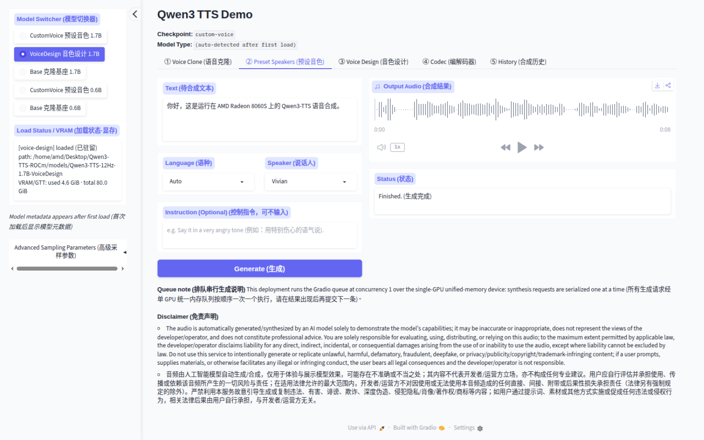
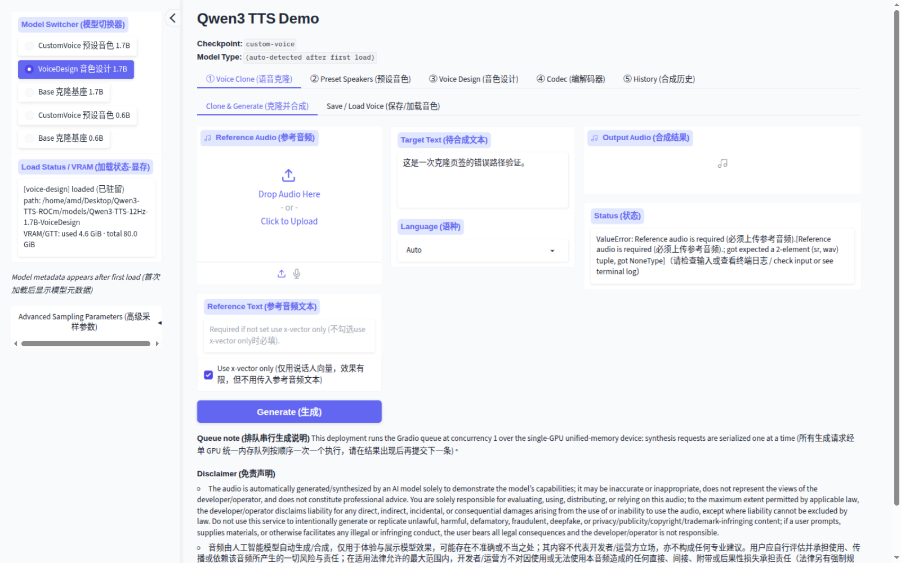
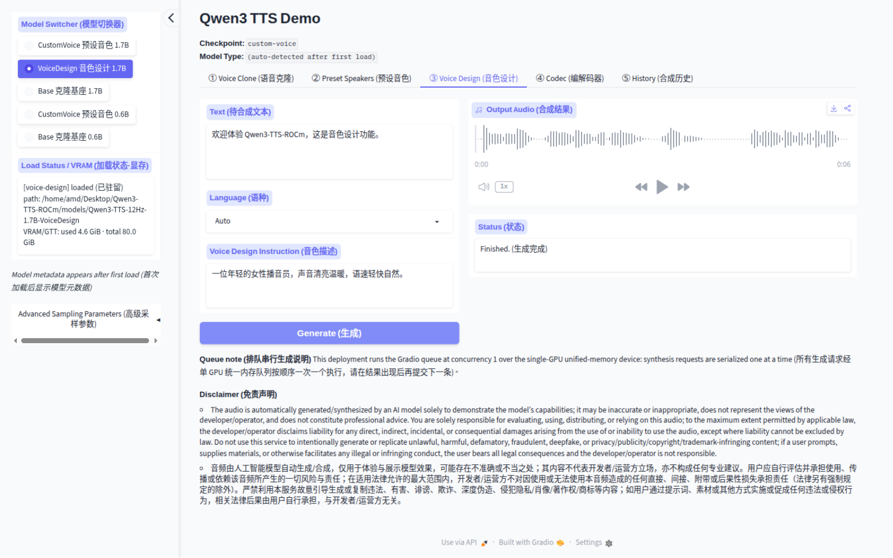
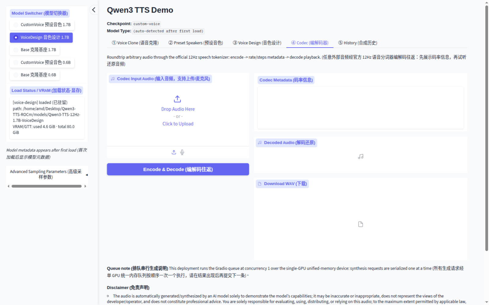
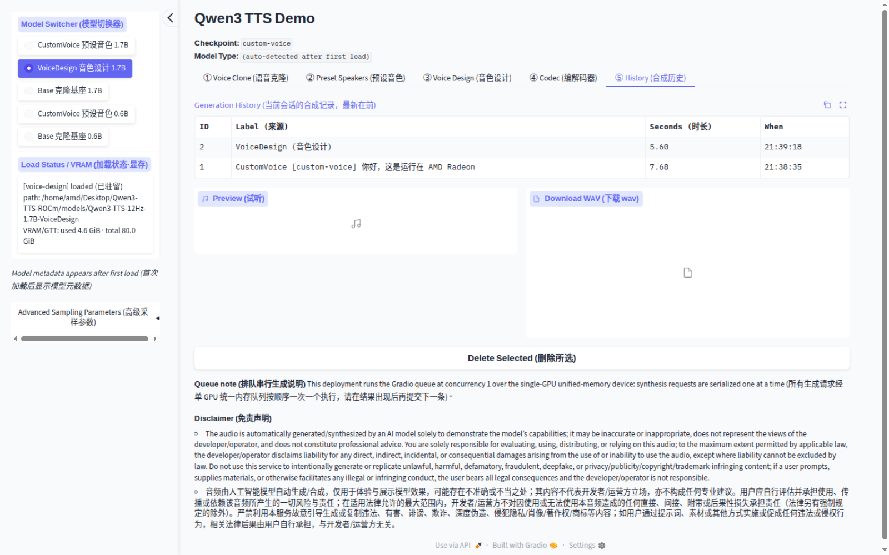

# Qwen3-TTS on AMD ROCm

**官方 Qwen3-TTS。AMD Radeon。零上游补丁。**

> ### 北极星（North Star）
>
> **AMD Radeon 上的官方 Qwen3-TTS —— 能力逐项验证、基准逐项实测、零上游补丁。**
>
> 下文每一个标注 ✅ 的能力结论，都是在真实 Radeon 8060S（`gfx1151`）
> 验证主机上、经未经修改的官方 `qwen-tts` API 端到端跑出来的，并附上
> 证明它的逐字运行记录链接。未验证的内容会如实标注。不打百分比分数，
> 不做超出已验证配置的泛化。

在 AMD Ryzen AI Max+ PRO 395 / Radeon 8060S（`gfx1151`）上原样运行官方
[`qwen-tts`](https://github.com/QwenLM/Qwen3-TTS) 包：一条命令安装 AMD 锁定
版本的 ROCm 7.14.0 PyTorch 轮子，一条下载官方权重，一条启动双语六标签页
Gradio 演示（`http://localhost:8000`）。所有合成调用全部走未经修改的官方 API。

[English](README.md) | **简体中文**

[](https://github.com/AIwork4me/Qwen3-TTS-ROCm/actions/workflows/ci.yml)
[](https://github.com/AIwork4me/Qwen3-TTS-ROCm/actions/workflows/gpu-nightly.yml)
[](https://github.com/AIwork4me/Qwen3-TTS-ROCm/releases)
[](LICENSE)
[](https://www.python.org/)
[](https://rocm.docs.amd.com/)
[](docs/benchmarks.md#platform)

非官方社区项目 —— 与阿里巴巴及 AMD 无隶属或背书关系，见[归属与免责声明](#归属与免责声明)。

## 验证结果，而非承诺

| 验证项 | 结果 |
|---|---|
| 官方模型仓库 | **6 / 6 已通过加载验证** —— 5 个 TTS checkpoint + tokenizer |
| 自动化测试 | **验证主机 357 / 357 全通过** —— 317 CPU + 40 真机 GPU（2026-09-24 起 +2 项可复用提示批量测试） |
| 对上游 `qwen-tts` 的补丁 | **0** —— 由专门的一致性测试强制保证 |
| GPU · ROCm | Radeon 8060S（`gfx1151`）· ROCm 7.14.0（`torch 2.12.0+rocm7.14.0`） |
| 精度 / 注意力 | bfloat16 · PyTorch SDPA —— 本次验证栈未启用 FlashAttention |
| 证据 | 逐字运行记录见 [`evidence/`](evidence/README.md) |

### 能力矩阵（Radeon 8060S · `gfx1151`）

一行一项能力，每个绿色单元格都链接到证明它的逐字存档。状态含义：
✅ **Radeon 端到端已验证**（验证主机上真实合成 / 真实运行，且通过健全性
断言）· 🟡 **部分验证 —— 仅加载**（能加载，无功能验证）· ⬜ **未验证** ·
🚫 **上游未暴露或本项目有意不声明**。

| 能力 | 模型 | Radeon 状态 | 证据 |
|---|---|---|---|
| 定制音色生成 CustomVoice（预设/自选说话人） | 1.7B | ✅ 端到端已验证 | [`gen-customvoice.txt`](evidence/gen-customvoice.txt) · RTF 见 [`benchmark.json`](evidence/benchmark.json) |
| 定制音色生成 CustomVoice | 0.6B | ✅ 端到端已验证 | [`gpu-suite-2026-09-20.txt`](evidence/gpu-suite-2026-09-20.txt) · [`benchmark-06b-2026-09-20.json`](evidence/benchmark-06b-2026-09-20.json) |
| 音色设计 VoiceDesign（按文字描述创建音色） | 1.7B | ✅ 端到端已验证 | [`gen-voicedesign.txt`](evidence/gen-voicedesign.txt) · RTF 见 [`benchmark.json`](evidence/benchmark.json) |
| 语音克隆 —— 参考音频零样本克隆 | 1.7B Base | ✅ 端到端已验证 | [`gen-voiceclone.txt`](evidence/gen-voiceclone.txt) · RTF 见 [`benchmark.json`](evidence/benchmark.json) |
| Base 家族（零样本克隆 + 微调基座） | 0.6B | ✅ 端到端已验证 | [`gpu-suite-2026-09-20.txt`](evidence/gpu-suite-2026-09-20.txt) · [`benchmark-06b-2026-09-20.json`](evidence/benchmark-06b-2026-09-20.json) |
| 可复用克隆提示（`create_voice_clone_prompt` → 保存 → 加载 → 复用） | 1.7B 与 0.6B Base | ✅ 端到端已验证 | [`gen-voiceclone.txt`](evidence/gen-voiceclone.txt) · [`gpu-suite-2026-09-20.txt`](evidence/gpu-suite-2026-09-20.txt) |
| 设计 → 克隆 → 复用（音色工坊一键流程） | VoiceDesign 1.7B + Base | ✅ 端到端已验证 | [`voice-workflow-2026-09-20.txt`](evidence/voice-workflow-2026-09-20.txt) · [`voice-workflow-2026-09-20.json`](evidence/voice-workflow-2026-09-20.json) |
| 官方 API 批量推理（文本列表，零自定义批处理层） | 0.6B 与 1.7B CustomVoice · 1.7B VoiceDesign · 0.6B 与 1.7B Base（可复用克隆提示路径） | ✅ 端到端已验证 —— B ∈ {1,2,4,8} 全绿，五个家族最大验证批量 B = 8（仅限本机/本配置） | [`batch-inference-gfx1151-2026-09-24.txt`](evidence/batch-inference-gfx1151-2026-09-24.txt) · [`batch-inference-gfx1151-2026-09-24.json`](evidence/batch-inference-gfx1151-2026-09-24.json) |
| 长文本合成与持续会话稳定性 | 1.7B CustomVoice | ✅ 端到端已验证 —— 阶梯 8/8 档至 892 字符 / 58 秒音频（自然 EOS，不声明最大长度）；60 分钟常驻压力测试 815/815 全部成功、零失败；10/10 次加载→生成→卸载循环（RSS 趋平；不做无泄漏声明） | [`long-text-gfx1151-2026-09-24.txt`](evidence/long-text-gfx1151-2026-09-24.txt) · [`soak-gfx1151-2026-09-24.txt`](evidence/soak-gfx1151-2026-09-24.txt) |
| 12Hz 分词器编解码（编码 → 解码往返） | Tokenizer-12Hz | ✅ 端到端已验证 | [`tokenizer-codec.txt`](evidence/tokenizer-codec.txt) |
| 多语言矩阵 —— 全部 10 种官方支持语言端到端 | 1.7B CustomVoice + VoiceDesign + Base | ✅ 端到端已验证 | [`multilingual-matrix.txt`](evidence/multilingual-matrix.txt) · [`multilingual-matrix.json`](evidence/multilingual-matrix.json) |
| 基于 ASR 的内容正确性 + 克隆相似度对照（质量基准 v2） | 1.7B CustomVoice ×10 语言 · 1.7B Base 克隆 | ✅ 已测量 —— whisper-small CER/WER：9/10 语言 0.00–0.05（德语 0.55 离群，仅为 ASR 一致性度量）；克隆余弦 正例 0.63–0.68 > 负例 0.58–0.60；不设阈值、无综合分、不声明 MOS | [`quality-v2-gfx1151-2026-09-24.txt`](evidence/quality-v2-gfx1151-2026-09-24.txt) · [文档](docs/quality-v2.md) |
| 微调（官方 `finetuning/` SFT 工作流） | 1.7B Base · 0.6B Base | ✅ 限定范围 —— **仅执行冒烟验证**（1.7B：2026-09-20；0.6B：同一协议 ×2 次独立运行，2026-09-24 —— 准备 → 12 步 → 保存 → 指纹 → 重载 → 合成健全）。**不做**收敛/质量/多说话人声明。ROCm 开箱微调当前有两个已披露的上游阻断项：PR #373（OPEN；flash-attn 硬编码，issue #372）与 0.6B text-projection 缺失（sft_12hz.py 直接相加文本与编解码嵌入、遗漏推理路径必经的 `text_projection`；在 0.6B 上构造性形状错误；变通仅限 gitignored 克隆，上游 issue 已起草待批） | [`finetune-smoke-2026-09-20.txt`](evidence/finetune-smoke-2026-09-20.txt) · 0.6B：[`run1`](evidence/finetune-06b-gfx1151-run1-2026-09-24.txt) · [`run2`](evidence/finetune-06b-gfx1151-run2-2026-09-24.txt) · PR #373 验证链：[`upstream-372-root-cause.md`](evidence/upstream-372-root-cause.md) · [`e2e-run1`](evidence/upstream-372-e2e-run1.txt) · [`e2e-run2`](evidence/upstream-372-e2e-run2.txt) |
| CustomVoice 的指令控制 instruct | 0.6B | 🚫 上游未暴露（封装对 0.6B 静默忽略 `instruct`）—— 由测试钉住 | 任务 0 审计：[`ground-truth-2026-09-20.md`](evidence/ground-truth-2026-09-20.md) |
| vLLM-Omni 服务（`/v1/audio/speech` + `/v1/audio/voices`） | 1.7B CustomVoice · 1.7B VoiceDesign · 1.7B Base 内联克隆 | ✅ 当前栈端到端已验证（vllm 0.30.0+rocm723 + vllm-omni 0.30.0rc1，上游配方调用）：三个任务族非流式服务均产出有效 24 kHz WAV；Base 内联克隆需遵守文档化的 `ref_audio` URL/data-URL/file-URI 契约 + `--allowed-local-media-path` | [`vllm-online-serving-gfx1151-2026-09-24.txt`](evidence/vllm-online-serving-gfx1151-2026-09-24.txt) · [JSON](evidence/vllm-online-serving-gfx1151-2026-09-24.json) · [WAVs](evidence/vllm-online-wavs) |
| vLLM-Omni 真流式（HTTP PCM） | 1.7B CustomVoice | ✅ 已测量 —— 客户端分片时间戳证明增量交付：短输入 TTFA 0.249 秒（ttfa/wall 0.115），453 字符输入 TTFA 0.222 秒（0.005）；22/389 分片；播放模拟欠载 1–2 次（突发节奏已记录）。上游 WebSocket 客户端在当前服务端构建上不可用（客户端/服务端路径与协议漂移，逐字证据 —— 非 gfx1151 故障） | [`vllm-streaming-gfx1151-2026-09-24.txt`](evidence/vllm-streaming-gfx1151-2026-09-24.txt) · [JSON](evidence/vllm-streaming-gfx1151-2026-09-24.json) |
| vLLM-Omni 服务并发（单 GPU） | 1.7B CustomVoice，短提示 | ✅ 已测量 —— 默认配置：c=2 可用（24.4 请求/分），c≥4 严重排队（c=8 E2E p50 273 秒）；stage-1 `max_num_seqs:1`（配置自带 TTFA 注释）：c=8 稳定可用（TTFA p50 0.74 秒、E2E 8.6 秒、34.9 请求/分、1.50 音频秒/墙钟秒）；所有级别零失败/零 OOM；仅限本机 | [`vllm-concurrency-gfx1151-2026-09-25.txt`](evidence/vllm-concurrency-gfx1151-2026-09-25.txt) · [服务指南](docs/vllm-omni-gfx1151-serving.md) |
| 真流式推理 | — | 🚫 上游未暴露 —— 2026-09-21 在 gfx1151 上实测：qwen-tts 0.1.1 官方 Python API 仅在调用完成时一次性返回音频（每次运行恰 1 个分片；首音频时间 == 总墙钟） | [`streaming-2026-09-21.txt`](evidence/streaming-2026-09-21.txt) · [路线图](#真流式推理) |

有一个概念边界值得直说（演示与文档均遵守）：**CustomVoice 是预设/
定制说话人音色生成** —— 它不从参考音频克隆。**Base 才是零样本语音克隆
与微调的家族。** 下方的逐 checkpoint 表和多语言表是同一批证据的细化
视图。

逐 checkpoint 验证层级（加载 = 经 `loader.load` 完成加载；端到端合成 =
GPU 上真实合成并通过健全性断言；基准测试 = 已存档的 RTF 实测）：

| 模型 | 加载 | 端到端合成 | 基准测试 |
|---|---|---|---|
| 1.7B 定制音色 CustomVoice | ✅ | ✅ | ✅ |
| 1.7B 音色设计 VoiceDesign | ✅ | ✅ | ✅ |
| 1.7B Base（克隆） | ✅ | ✅ | ✅ |
| 0.6B 定制音色 CustomVoice | ✅ | ✅ | ✅（见 `evidence/benchmark-06b-2026-09-20.json`） |
| 0.6B Base（克隆） | ✅ | ✅ | ✅（同上） |
| 12Hz 分词器 Tokenizer | ✅ | 编解码 ✅ | 不适用 |

注意：0.6B CustomVoice 在上游没有指令控制能力；演示与文档均如实反映该边界。

### 多语言能力矩阵

每一个官方支持的语言都在 Radeon GPU 上完成了端到端验证（10 次
CustomVoice + 10 次 VoiceDesign 生成，外加 4 对代表性跨语言克隆，经由
1.7B Base 模型；同一时刻只驻留一个模型）。复现命令：
`.venv/bin/python scripts/validate_languages.py 2>&1 | tee evidence/multilingual-matrix.txt`
（运行记录：`evidence/multilingual-matrix.txt`，机器可读逐行数据：
`evidence/multilingual-matrix.json`）。

| 语言 | 定制音色 CustomVoice | 音色设计 VoiceDesign | 跨语言克隆 |
|---|---|---|---|
| 中文 Chinese | ✅ | ✅ | ✅（参考：en、fr） |
| 英语 English | ✅ | ✅ | ✅（参考：zh、ja） |
| 日语 Japanese | ✅ | ✅ | — |
| 韩语 Korean | ✅ | ✅ | — |
| 德语 German | ✅ | ✅ | — |
| 法语 French | ✅ | ✅ | — |
| 俄语 Russian | ✅ | ✅ | — |
| 葡萄牙语 Portuguese | ✅ | ✅ | — |
| 西班牙语 Spanish | ✅ | ✅ | — |
| 意大利语 Italian | ✅ | ✅ | — |

✅ = 已在经过验证的 Radeon 8060S（`gfx1151`）主机上完成端到端生成（波形
健全性：有限值、非静音、有效采样率、时长有界）——见
`evidence/multilingual-matrix.json`。这不是发音质量声明。跨语言克隆覆盖为
代表性抽样（4 对），并非穷举。

### 音色设计 → 可复用音色（音色工坊 Voice Studio）

官方演示从未把自己的能力串成完整链路：一个标签页能设计音色，另一个
标签页能克隆上传的音频，但要把一个「描述出来」的音色变成「可复用」
的音色，就得手动下载再上传。`qwen3_tts_rocm.voice_workflow` 只用三个
官方 API —— `generate_voice_design`、`create_voice_clone_prompt`、
`generate_voice_clone` —— 在未经修改的 `loader.load` 对象上补齐了这条
链路，并遵循官方的模型分工（设计在 VoiceDesign 权重上运行；提示构建
与复用在 Base 权重上运行——官方封装按 `tts_model_type` 硬性校验）：

```python
from qwen3_tts_rocm import loader, voice_workflow

vd, bc = loader.load("voice-design"), loader.load("base")
res = voice_workflow.design_voice(            # 预览 + 可复用提示项
    vd, prompt_model=bc, text="今天的天气真不错，适合去公园散步。",
    language="Auto", description="年轻女性，声音清亮，语速轻快")
voice_workflow.save_voice(res, "voices/bright.pt")   # 官方载荷 + 元信息
loader.unload(vd)                             # 仅保留 Base 驻留
res2 = voice_workflow.load_voice("voices/bright.pt")
wav, sr, gen_s = voice_workflow.reuse_voice(  # 任意新句子，同一音色
    bc, prompt_items=res2.prompt_items, text="晚风轻轻吹过湖面。", language="Auto")
```

逐字稿规则由构造保证：每个提示项里的 `ref_text` 恰好就是生成参考音频
的那段文本（同一个变量喂给两次官方调用）。保存的音色就是官方演示文件
——`"items"` 键与上游演示的 `{"items": [asdict(item) ...]}` 载荷字节
格式一致，原版演示也能加载；同一 `.pt` 内的 `voice_meta` 附带信息保留
描述/语言/逐字稿来源。

演示界面的 **⑥ Voice Studio（音色工坊）** 标签页把这条链路做成了一键
流程 —— 描述 → 试听 → 保存 → 复用 —— 全程没有任何下载或重新上传（已
保存音色下拉框取代了文件往返）。验证主机（Radeon 8060S，bf16，每次生
成 `max_new_tokens=512`，三个阶段分别计时、绝不合并）上的实测延迟：
**设计 ≈ 5.5 秒 · 提示构建 ≈ 0.3 秒 · 复用 ≈ 5.3–6.4 秒/句**。复现命令：
`.venv/bin/python -m pytest tests/test_voice_workflow.py -m gpu -v -s`
（运行记录：`evidence/voice-workflow-2026-09-20.txt`，机器可读计时：
`evidence/voice-workflow-2026-09-20.json`）。

CPU-only CI 在 Python 3.10 / 3.11 / 3.12 上收集的是同样这 313 项 CPU 测试，
其中 1 项 HIP 环境门控测试因 CI 机器没有 AMD GPU 而跳过；在未安装可选
`[quality]` 附加组件的纯 `.[dev]` 环境中，另有 15 项**可见**跳过（12 项
jiwer + 3 项 resemblyzer 质量基准测试；2026-09-21 声明审计将其由报错改为
可见跳过 —— 此前 Task 14 未加保护的 `import jiwer` 曾使 CI 变红）。在实际
ROCm 验证主机上该项也会执行，因此验证主机为 317 CPU + 40 GPU = 357 / 357（2026-09-24 起新增 2 项批量推理测试）
全通过。本套件的首次实证 CI 运行：推送 `8815238` 全部 job 绿灯（[运行
35526426415](https://github.com/AIwork4me/Qwen3-TTS-ROCm/actions/runs/35526426415)，
每个 Python job `251 passed, 1 skipped, 38 deselected`——于 2026-09-21 验证，
当时套件为 252 项 CPU 测试，其后套件已增长到上列数量——转录见
`evidence/ci-2026-09-21-8815238.txt`）。

**GPU CI 状态：已上线（LIVE）** —— 自托管 GPU 回归工作流
（`.github/workflows/gpu-nightly.yml`：`gfx1151` 验证主机上的夜间短套件
+ 手动全量矩阵）已于 2026-09-23 首次真实运行全绿（[运行
35857806038](https://github.com/AIwork4me/Qwen3-TTS-ROCm/actions/runs/35857806038)，
`gpu-short`，32 项 GPU 测试节点，提交 `a3a8a75`），并于 2026-09-24 首次
`full-weekly` 全绿（[运行
35964051504](https://github.com/AIwork4me/Qwen3-TTS-ROCm/actions/runs/35964051504)，
提交 `09ca9fd`：全部 40 项 GPU 测试节点 314 秒内通过、`verify_gpu.sh`
栈健全性检查通过、三个 1.7B 别名的 RTF 基准复现 —— 12 个单元，中位
RTF 1.27–1.40 —— 基准 JSON 已作为可下载的运行工件持久化）。夜间窗口为本地
（+08:00）02:00 = 18:00 UTC，仅当验证主机在该时刻开机在线时才会运行 ——
错过窗口并非回归信号，可按运维手册手动补跑。筛选证明：
`evidence/gpu-ci-prep-validation.txt`；首跑逐字记录：
`evidence/gpu-ci-first-green-2026-09-23.txt`；full-weekly 逐字记录：
`evidence/gpu-ci-full-weekly-first-green-2026-09-24.txt`；运维手册：
[`docs/development/gpu-ci-runbook.md`](docs/development/gpu-ci-runbook.md)。

下面是验证真机上实拍的演示标签页：



🔊 **听一下** —— [5.5 秒中文示例](evidence/demo-rest-gen-zh.wav)，
由验证运行中经演示 REST API 生成，过程记录见
[`evidence/demo-smoke.txt`](evidence/demo-smoke.txt)。

## 快速开始

### 🚀 先跑起来（约 5 GB 下载）

入门**不需要**一次下齐六个权重。`tokenizer` + `custom-voice` 子集（约 5 GB）
足以运行下面的 Python 片段，以及演示中的**预设音色**和**编解码器**标签页：

```bash
git clone https://github.com/AIwork4me/Qwen3-TTS-ROCm.git
cd Qwen3-TTS-ROCm
bash scripts/install.sh                              # venv + AMD 锁定 ROCm 轮子 + GPU 闸门
bash scripts/download_models.sh tokenizer custom-voice   # 约 5 GB，ModelScope 优先
bash scripts/run_demo.sh                             # -> http://localhost:8000
```

也可以跳过界面——最能证明 loader 承诺的最小程序（只经我们加载一次，
之后全是纯官方 API，与上游快速开始一致）：

```python
from qwen3_tts_rocm import loader

tts = loader.load("custom-voice")            # sdpa/bf16 defaults on gfx1151
wavs, sr = tts.generate_custom_voice(text="你好，ROCm。", language="auto",
                                     speaker=tts.get_supported_speakers()[0])

import soundfile as sf
sf.write("hello-rocm.wav", wavs[0], sr)  # 保存 / save
```

把它存成 `hello.py`，并**在安装脚本的 venv 里运行**：每个终端先执行一次
`source .venv/bin/activate`，再 `python hello.py`；或直接用
`.venv/bin/python hello.py`。系统 `python` 看不到本包；
`qwen3-tts-rocm-check` 同样需要先激活 venv。

更轻的选择：`bash scripts/download_models.sh tokenizer custom-voice-0.6b`
（约 3 GB），片段中改用 `custom-voice-0.6b` 别名即可。

**预期表现：** 模型加载时长与文件系统缓存状态强相关——验证真机上同会话内
加载为 2.2–4.9 秒，冷启动更久；首次运行还有一次性的 MIOpen 内核调优
（之后有缓存）。终端只打印一行 loader 状态提示；首见的 MIOpen 控制台刷屏
属正常（[故障排查](docs/troubleshooting.md)）。权重下载到 `models/`
（可用 `$QWEN3_TTS_ROCM_MODELS_DIR` 改写）；中断可续传，重跑会跳过已完成的仓库。

### 完整体验（约 18 GB）

```bash
bash scripts/download_models.sh   # 全部六个官方仓库
bash scripts/run_demo.sh
```

| 别名 | 官方仓库 | 大小 |
|---|---|---|
| `tokenizer` | `Qwen/Qwen3-TTS-Tokenizer-12Hz` | 651M |
| `custom-voice` | `Qwen/Qwen3-TTS-12Hz-1.7B-CustomVoice` | 4.3G |
| `voice-design` | `Qwen/Qwen3-TTS-12Hz-1.7B-VoiceDesign` | 4.3G |
| `base` | `Qwen/Qwen3-TTS-12Hz-1.7B-Base` | 4.3G |
| `custom-voice-0.6b` | `Qwen/Qwen3-TTS-12Hz-0.6B-CustomVoice` | 2.4G |
| `base-0.6b` | `Qwen/Qwen3-TTS-12Hz-0.6B-Base` | 2.4G |

模型不齐时演示照常启动；缺哪一族模型，对应标签页会明确提示而不是莫名报错。
`scripts/install.sh --with-models` 可串联安装与下载；`qwen3-tts-rocm-check`
随时可做双语环境自检（只读，绝不抛异常）。

## 你能得到什么

* **`qwen3-tts-rocm-check`** —— 双语 ROCm 环境自检，绝不抛异常。
* **`loader.load(alias)` / `loader.unload()`** —— 通过官方公开参数施加智能
  默认值（HIP 上 `device_map=auto`、`bfloat16`、`sdpa`），返回**原生官方模型
  对象**，绝无包装。加载绝不会在背后偷偷下载权重——模型缺失时抛出
  `RuntimeError` 并直接给出下载命令。
* **六别名下载器** —— ModelScope 优先、`hf-mirror.com` 回退（记录中的验证
  主机即在中国大陆网络环境下全程免 VPN 完成下载；其他网络环境可能有差异），
  支持断点续传，可按别名或整批下载。
* **六标签页双语 Gradio 演示**（中文/English）：① 语音克隆（含可保存/复用的
  音色提示）· ② 预设音色 · ③ 音色设计 · ④ 编解码器往返 · ⑤ 合成历史 ·
  ⑥ 音色工坊 Voice Studio（描述 → 试听 → 保存 → 复用，全程无下载再上传）。
  侧边栏含模型切换器（同一时刻只驻留一个模型）、实时 VRAM/GTT 读数与高级
  采样参数折叠区。
  <details>
  <summary>标签页截图（①–⑤）</summary>

  | | |
  |---|---|
  |  |  |
  |  |  |
  |  | *语音克隆 · 预设音色 · 音色设计 · 编解码器 · 合成历史* |

  </details>

  演示说明：生成按队列并发 1 串行执行——单 GPU 统一内存设备只驻留一个模型，
  并发合成本来也会被串行化进同一块算力池。克隆/编解码器标签页的麦克风输入
  需要安全上下文：在本机用 `http://localhost:8000` 打开，或改走 TLS（先用一行
  `openssl` 生成自签名证书对，再 `bash scripts/run_demo.sh --ssl-certfile
  cert.pem --ssl-keyfile key.pem`）。详见
  [`docs/troubleshooting.md`](docs/troubleshooting.md)。
* **512 token 生成护栏** —— 限定渲染时长；上游默认 2048 下采样偶尔会退化成
  数分钟的循环（实测一次约 23 分钟）。确有必要时再经高级折叠区或
  `gen_kwargs` 覆盖。
* **可复现的 RTF 基准**（`scripts/benchmark.py`），方法学公开、原始输出存档。
* **Docker 镜像**，含 `/dev/kfd` + `/dev/dri` 直通
  （[docker/README.md](docker/README.md)）。
* **测试套件** —— 验证主机 357/357 全通过（317 CPU + 40 真机 GPU）；
  CPU-only CI 在 Python 3.10 / 3.11 / 3.12 上收集同样这 313 项 CPU 测试，
  其中 1 项 HIP 门控跳过（纯 `.[dev]` 环境中另有上文所述 15 项 `[quality]`
  附加组件可见跳过；最近一次按规模实证绿灯的 CI 运行为 267-CPU 时期：
  运行 [35545854932](https://github.com/AIwork4me/Qwen3-TTS-ROCm/actions/runs/35545854932)，
  `266 passed, 1 skipped` —— 313-CPU 时期曾因 Task 14 未声明的 jiwer 导入
  变红，直到声明审计修复为止，见
  [`evidence/claims-audit-2026-09-21.md`](evidence/claims-audit-2026-09-21.md)）。
  下文的上游一致性证明属于 40 项 GPU 测试之一，
  在验证主机上运行，不在 CPU-only CI 中。

<a id="why-this-project-exists"></a>

## 为什么选择 Qwen3-TTS-ROCm？

上游 Qwen3-TTS 的部署文档以 CUDA / FlashAttention 为主。本项目在不修改官方
`qwen-tts` 包的前提下，补充一条经过验证的 `gfx1151` ROCm 部署路径——只是一层
薄壳：环境诊断、智能默认加载器、双源下载器和增强版演示界面。不是 fork；
永远不内置、不补丁上游源码。

| 能力 | 上游 Qwen3-TTS | Qwen3-TTS-ROCm |
|---|---|---|
| 官方 Qwen3-TTS API | ✅ | ✅（未修改） |
| 官方模型权重 | ✅ | ✅（不再分发） |
| gfx1151 ROCm 路径已验证 | — | ✅ |
| 一条命令安装 ROCm 轮子 | — | ✅ |
| ROCm 环境自检 | — | ✅ |
| ModelScope 优先下载器 | — | ✅ |
| AMD iGPU 上的 RTF 基准证据 | — | ✅ |
| 官方微调工作流（SFT）在 ROCm 上 | ✅（文档面向 CUDA + FlashAttention） | ✅ 限定为**仅执行验证（冒烟）**：数据准备 → 12 步训练 → checkpoint 保存 → 重载 → 合成通过健全性检查（不涉及音色相似度/收敛/质量结论）——1.7B Base（2026-09-20）与 0.6B Base（×2 次独立运行，2026-09-24）均已执行验证。ROCm 端到端执行已验证；开箱微调存在两个已披露的上游阻断项（PR #373 OPEN + 0.6B text-projection 缺失，见上方能力矩阵行）。上游可移植性修复已作为 Qwen3-TTS PR #373 提交（OPEN）——其验证链为：原始失败双重复现 → 最小修复受控隔离 → 3 次针对性加载验证 → 修复分支两次独立 E2E → 默认 `flash_attention_2` 语义保持 → 独立链路校验 PASS。在合并之前，当前已发布的 `qwen-tts==0.1.1` 仍需以下已披露的临时变通：上游硬编码的 `flash_attention_2` → `sdpa`，仅在 gitignored 的 `.upstream` 克隆内改动并已还原。详见 [`docs/finetuning-rocm.md`](docs/finetuning-rocm.md) |

<a id="兼容性"></a>

## 兼容性

| GPU / 平台 | 架构 | ROCm | 状态 | 证据 |
|---|---|---|---|---|
| Radeon 8060S / Ryzen AI Max+ PRO 395 | `gfx1151` | 7.14.0 | ✅ 已验证 —— 唯一经过独立验证的配置 | [`evidence/`](evidence/README.md) |
| 其他 ROCm capable AMD GPU | — | — | 🧪 **尚未验证 —— 欢迎社区实测** | 提交 issue 并附上 `qwen3-tts-rocm-check` 输出 |

loader 的 HIP 默认值是通用的，但本仓库的每个数字与结论都只追溯到上表这一
个已验证配置。请勿臆断其他显卡能或不能用——非常欢迎其他 ROCm 硬件的实测
反馈，验证后会在表中列出。注意：仓库自带 `scripts/install.sh` 是已验证的
`gfx1151` 安装路径（锁定 `device-gfx1151` 轮子）；测试其他架构时，请使用
对应的 ROCm PyTorch 栈，并在验证报告中记录完整安装方式。

**在其他 AMD GPU 上跑通了？[提交硬件验证报告](https://github.com/AIwork4me/Qwen3-TTS-ROCm/issues/new?template=hardware-validation.yml)**——只收实测结果，验证后兼容性矩阵随你扩展。

## 性能

在 Ryzen AI Max+ PRO 395、bfloat16/sdpa、短句与中等长度文本、上限
`max_new_tokens=512` 条件下实测的**中位 RTF**——*每生成一秒音频消耗的实际
秒数，越低越好*。RTF 1.3 的含义是：生成 1 秒音频约消耗 1.3 秒计算时间。

| 工作负载 | 中位 RTF |
|---|---:|
| 定制音色 Custom Voice（1.7B） | 1.31 – 1.51 |
| 音色设计 Voice Design（1.7B） | 1.27 – 1.62 |
| 零样本语音克隆（`base` 1.7B） | 1.71 – 1.88（2026-08-27 会话） |

在 iGPU 上等几秒得到几秒语音——句子级交互演示可用，批量离线合成更是从容。
`base` 行为 2026-08-27 会话数据；2026-09-21 复测在非热浸泡条件下测得
1.27 – 1.40（基线 `base` 各格紧随 1396 秒预热——见
[`docs/benchmarks.md`](docs/benchmarks.md) 跨天复测章节）。我们只给区间，不做绝对延迟承诺：统一内存共享池上，数字随时钟、温度、内存
压力与后台负载漂移。完整分格表格、方法学、n=2 注意事项与复现命令见
[`docs/benchmarks.md`](docs/benchmarks.md)。**基准 v2（2026-09-24）**补充了可控复现性——五个别名（每家族 1.7B + 0.6B）、每格 n=5 固定种子、冷启动/预热/测量三阶段分离、每格 median/min/max/mean/stdev——见
[`docs/benchmarks-v2.md`](docs/benchmarks-v2.md)（RTF 中位数 1.04–1.52，每格标准差 ≤ 0.11）。

<a id="路线图尚未验证"></a>

## 路线图（尚未验证）

本节内容**只按带证据链接的状态行声明，不做任何超出证据的结论** ——
它们是阶梯的横档，每一级都必须先有证据，任何 ✅ 才可能出现。上游已有、
但在 Radeon 上尚无证据的特性也列在这里（vLLM-Omni 的离线、在线服务与
HTTP-PCM 流式均已有证据 —— 见能力矩阵各行与下方链接；WebSocket 流式
在当前构建上仍为上游客户端/服务端不兼容）。

### vLLM-Omni 在 ROCm 上

官方技术栈为 Qwen3-TTS 提供了 vLLM-Omni 服务路径；它是面向 CUDA 的部署
方案。计划严格按顺序推进 —— 先做可行性，不跳级：

1. **可行性验证** —— 先弄清 vLLM-Omni 在锁定的 ROCm 轮子技术栈上能否
   构建和导入（可能需要该栈不具备的内核或轮子）。产出：带证据的 go/no-go
   结论。**2026-09-21 状态：GO** —— 按上游自己的安装文档执行
   （`vllm==0.28.0+rocm723` 轮子 + `vllm-omni==0.28.0` +
   `onnxruntime-rocm`，装在独立的 gitignored venv 中，已验证的 `.venv`
   未改动）。该轮子内嵌编译好的 `gfx1151` 代码对象；官方文档最小的离线
   示例（`end2end.py --query-type CustomVoice`，逐字节未修改）在
   gfx1151 上两次运行均产出有限、非静音的 6.0 s / 24 kHz WAV —— 见
   [`vllm-omni-feasibility-2026-09-21.txt`](evidence/vllm-omni-feasibility-2026-09-21.txt)
   / [`.json`](evidence/vllm-omni-feasibility-2026-09-21.json)。
   范围：一个示例、单一配置、独立 venv —— 不声明其他任何结论。
   **当前栈复核 2026-09-24（v0.2.1 任务 8）：vllm 0.30.0+rocm723 +
   vllm-omni 0.30.0rc1、逐字上游 end2end.py（main `7e5897b…`），三个
   1.7B 任务族离线全部通过** —— 见
   [`vllm-omni-current-gfx1151-2026-09-24.txt`](evidence/vllm-omni-current-gfx1151-2026-09-24.txt)。
   此后（v0.2.1 任务 9，同日深夜）：三个任务族的在线服务与 HTTP-PCM
   真流式均已取得证据（见上方矩阵行）；WebSocket 横档仍为上游不兼容。
2. 若可行：**以本仓库已验证的 PyTorch / `qwen-tts` ROCm 路径为基线**，
   作为正确性参照。
3. **vLLM-Omni 离线推理**（gfx1151）—— 先做单请求正确性对照（相对
   PyTorch 路径），性能放后。
4. **性能表征** —— RTF、加载时间、内存，沿用
   [`docs/benchmarks.md`](docs/benchmarks.md) 的公开方法学纪律。
5. **在线服务** —— 仅当上游在 ROCm 兼容运行时上支持所需服务路径后才
   尝试；在那之前不动。
6. **并发测试** —— 已验证设备是单 GPU 统一内存 iGPU；并发请求行为必须
   实测，不能假设。
7. **生产指导** —— 在以上全部完成之后才给出，且限定于已验证配置。

### 真流式推理

上游文档给出流式生成及「97 ms」量级的首音频指标。**该数字是上游自己、
在上游自己的技术栈上测的 —— 它不是 Radeon 数字**，永远不得在本项目中
当作 Radeon 数字使用。

**2026-09-21 实测结论（已存档）：** 本地安装的官方 `qwen-tts` 0.1.1
Python API **不存在增量音频通路**。三个官方入口
（`generate_custom_voice` / `generate_voice_design` / `generate_voice_clone`）
都是普通阻塞函数，在调用完成时一次性返回完整波形列表 —— 无一为生成器，
也未提供任何分片回调或 streamer 参数（模型内部的 talker `generate`
以固定关键字集合被调用，streamer 类 kwarg 不会被转发）；编解码
（codec decode）是对完整序列的单次调用。封装层自带文档字符串明确写道：`non_streaming_mode=False`
「仅模拟流式文本输入……而非启用真正的流式输入或流式生成」（签名与
逐字引文及 file:line 证据均由脚本机采，见存档）。在已验证的
CustomVoice 1.7B 路径上用
[`scripts/streaming_probe.py`](scripts/streaming_probe.py) 于 gfx1151
实测 —— 每个场景 2 次、`non_streaming_mode` 两种取值、短文本（17 字）
与长文本（205 字）各测：**每一次运行都在返回时刻一次性交付唯一一个
音频分片**。因此首音频时间在每次运行中都等于总墙钟（短文本 3.4–4.0 s、
RTF 1.22–1.25；长文本 66–79 s 墙钟产出 52–59 s 音频、RTF 1.28–1.34），
分片节奏无定义（单次交付），而模拟实时消费者的 0 次欠载仅仅是因为
播放开始时音频已 100% 存在。完整数据：
[`streaming-2026-09-21.txt`](evidence/streaming-2026-09-21.txt) /
[`.json`](evidence/streaming-2026-09-21.json)。

在上游提供真正的增量交付 API 之前，流式在能力矩阵中保持 🚫。届时将用
同一探针在已验证的 gfx1151 主机上重新完成以下五项测量：

* **首音频时间（time to first audio）** —— 从请求发出到第一个可听分片的
  墙钟时间；
* **分片节奏（chunk cadence）** —— 相邻分片间隔的分布（是否安全、无欠载）；
* **总 RTF** —— 同一段文本的端到端实时率，并与非流式基线对照；
* **缓冲欠载行为（buffer underrun）** —— 持续生成下播放是否会出现饥饿；
* **长文本行为** —— 长输入下节奏与内存的保持情况。

在面向真正增量通路的这些测量完成并存档到
[`evidence/`](evidence/README.md) 之前，流式在能力矩阵中保持 🚫。

## 验证与可复现性

<a id="zero-modification-guarantee"></a>

* [`loader.load()`](src/qwen3_tts_rocm/loader.py) 返回的就是**官方
  `qwen_tts.Qwen3TTSModel.from_pretrained` 的返回值本身**——原生模型对象，
  绝无包装；智能默认值只通过公开的官方关键字参数施加。
* 证明靠测试：[`tests/test_official_demo_parity.py`](tests/test_official_demo_parity.py)
  用*我们* loader 加载出的模型对象构建原封不动的上游
  `qwen_tts.cli.demo.build_demo()`，再经 Gradio 自身的事件注册表执行演示
  自己的回调闭包——含一次真实 GPU 合成。绿色通过记录：
  [`evidence/official-parity.txt`](evidence/official-parity.txt)。
* 项目政策（见 [`CONTRIBUTING.md`](CONTRIBUTING.md) 与 [`NOTICE`](NOTICE)）：
  不内置、不补丁上游源码；`pyproject.toml` 原样依赖已发布的
  `qwen-tts==0.1.1` 制品。

自己动手复核：

```bash
bash scripts/verify_gpu.sh                    # ROCm 正常时打印 SPIKE-GPU-OK
qwen3-tts-rocm-check                          # 环境自检
python -m pytest -m "not gpu and not requires_download" -q   # 313 项 CPU 测试（无 AMD GPU 时 1 项 HIP 门控跳过；缺 .[quality] 时另有 15 项跳过）
python -m pytest -m "gpu" -q                  # 40 项 GPU 测试（需权重）
.venv/bin/python scripts/benchmark.py         # 全新 RTF 数据
```

每个引用的数字都可追溯到 [`evidence/README.md`](evidence/README.md) 中列出
的逐字记录。

## 已验证配置

开发与验证均在这台机器上完成（这是"实测配置"，不是"最低要求"）：

| 事实 | 数值 |
|---|---|
| APU | AMD Ryzen AI Max+ PRO 395（Radeon 8060S，`gfx1151`，Strix Halo 级） |
| 内存 | 94 GB LPDDR5X 统一内存池，torch/HIP 可见约 80 GiB |
| 内核 | Linux 6.17.0-1032-oem，`amdgpu` DRM 驱动（用 `rocm-smi` 确认） |
| ROCm / torch | 来自 `repo.amd.com` 的 7.14.0 代际轮子：`torch[device-gfx1151]==2.12.0+rocm7.14.0`（含 torchvision/torchaudio）—— 由 `scripts/install.sh` 自动安装，无需手敲 |
| Python | 验证主机为 3.12；CPU CI 矩阵运行 3.10 / 3.11 / 3.12 |

### 需求与已知约束

* **磁盘** —— 最小子集约 5 GB，六个仓库全量约 18 GB（权重位于 `models/`，
  从不提交入库）。
* **网络** —— 需可达 ModelScope（`modelscope.cn`）；`huggingface.co` 被阻断
  时回退传输自动改走 `hf-mirror.com`。记录中的验证主机在中国大陆网络下全程
  免 VPN 完成了全部下载——其他网络环境可能有差异。
* **GPU** —— 仅在 `gfx1151` 上验证过（见[兼容性](#兼容性)）；需要 `amdgpu`
  DRM 驱动正常工作，且能访问 `/dev/kfd` + `/dev/dri`（`render`/`video` 组）。
* **内存** —— 我们会话中驻留的 1.7B 模型（bf16）占用统一内存池约 4.6 GiB；
  更小内存机器的最低要求**未经实测**。共享统一内存池上，关闭吃内存的桌面
  应用可获得更好 RTF。

## Docker

可复现的 Docker 构建，通过 `/dev/kfd` + `/dev/dri` 直通在 ROCm 上运行；把
宿主机的 `models/` 目录挂载进镜像声明的卷即可：

```bash
docker build -f docker/Dockerfile -t qwen3-tts-rocm:dev .
docker run --rm \
    --device /dev/kfd --device /dev/dri \
    --group-add video --group-add render \
    -v "$PWD/models:/workspace/models" \
    -p 8000:8000 \
    qwen3-tts-rocm:dev
```

镜像验证记录：仅构建时代为 [`evidence/docker-build-final.txt`](evidence/docker-build-final.txt)；
**GPU 运行时 E2E（2026-09-24，v0.2.1）**——全新 `--no-cache` 镜像在
Radeon 8060S 上完成容器内全链路：ROCm torch/HIP 7.14 + gfx1151 诊断、
bf16 矩阵乘与 SDPA 有限性、torchaudio 导入、经仓库 loader 加载 0.6B
CustomVoice、一次真实官方 API 合成（3.84 秒音频 @ 24 kHz、非静音、WAV
落盘）以及 4 项 GPU pytest 切片——见
[`evidence/docker-gpu-e2e-gfx1151-2026-09-24.txt`](evidence/docker-gpu-e2e-gfx1151-2026-09-24.txt)
· [JSON](evidence/docker-gpu-e2e-gfx1151-2026-09-24.json) ·
[生成的 WAV](evidence/docker-gpu-e2e-gen-2026-09-24.wav)。
完整指南——组 GID 注意事项、无 GPU 诊断、无 GPU 冒烟测试——见
[`docker/README.md`](docker/README.md)。

## 故障排查

先运行 `qwen3-tts-rocm-check`（终端需先激活 venv：`source .venv/bin/activate`），
再到
[`docs/troubleshooting.md`](docs/troubleshooting.md) 对症查找——该指南逐条
展开诊断输出的每一条 `ERROR:` / `WARN:` / `INFO:`：

| 症状 | 修复文档 |
|---|---|
| `torch.cuda.is_available() is False` / `/dev/kfd` 权限 | [docs/troubleshooting.md](docs/troubleshooting.md) |
| `The installed PyTorch is NOT an AMD ROCm/HIP build` | [docs/troubleshooting.md](docs/troubleshooting.md) |
| Hugging Face 与 ModelScope 双双下载失败 | [docs/troubleshooting.md](docs/troubleshooting.md) |
| 显存不足或超长生成 | [docs/troubleshooting.md](docs/troubleshooting.md) |
| 首次运行的 MIOpen / SoX 控制台刷屏 | [docs/troubleshooting.md](docs/troubleshooting.md) |

两个常见问题的快速回答：**"这是一个模型吗？"** 不是——模型留在官方仓库
单独下载，本项目只是包裹它们的胶水。**"权重会提交进 git 吗？"** 永远不会；
参见 `.gitignore` 与 `$QWEN3_TTS_ROCM_MODELS_DIR`。

## 参与贡献

守则、开发环境搭建与 PR 清单见 [`CONTRIBUTING.md`](CONTRIBUTING.md)。头条
规则：贡献必须维护零修改保证——不改上游源码、不入库权重。Bug 反馈与硬件
实测请到 [issue 跟踪器](https://github.com/AIwork4me/Qwen3-TTS-ROCm/issues)。

<a id="归属与免责声明"></a>

## 归属与免责声明

* Qwen3-TTS 及全部模型权重出自**阿里巴巴 Qwen 团队**的工作
  （[上游仓库](https://github.com/QwenLM/Qwen3-TTS)，Apache-2.0；权重遵循
  阿里自有的 Qwen 模型许可——下载即接受其条款，详见 [`NOTICE`](NOTICE)）。
  本项目不再分发模型权重。
* Qwen3-TTS-ROCm 是一个**非官方社区适配版**；与阿里巴巴及 AMD 无隶属、
  背书或出品关系。
* 上游演示页脚节选浓缩：*生成的音频可能不准确或不当，不代表任何人的立场；
  如何合法使用由你自行负责——禁止制造违法、有害、深度伪造或侵权内容*
  （English: *generated audio may be inaccurate or inappropriate, does not
  represent anyone's views, and it is your responsibility to use it
  lawfully*）。

## 许可证

代码：Apache-2.0 —— 见 [`LICENSE`](LICENSE)。模型权重仍受阿里自有模型许可
约束（出处与下载条款见 [`NOTICE`](NOTICE)）。
